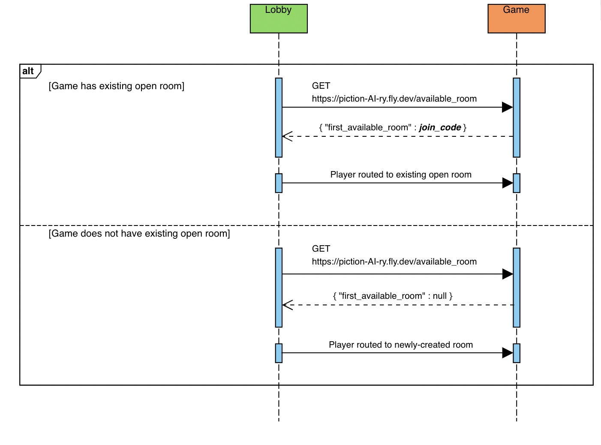

# Room Routing Sequence for Players who Choose to Play Against Randomly-selected Opponents

When a new player connects to the Lobby microservice, they will be given the option to play against either a friend or a randomly-selected player.

If the player chooses to play against a randomly-selected player, the Lobby microservice will query the Game microservice to determine if there is currently an available room with another player who chose to play against a random opponent. The Lobby queries the Game via a GET request sent to the endpoint "https://piction-ai-ry.fly.dev/available_room". If an available room exists, the Game will respond with a JSON object containing the join-code for that room; if an available room does not exist when the Game is queried, the Game will respond with a JSON object containing a null value.

After receiving a response from the Game, the Lobby will route the new player to a room based upon the response from the Game microservice.